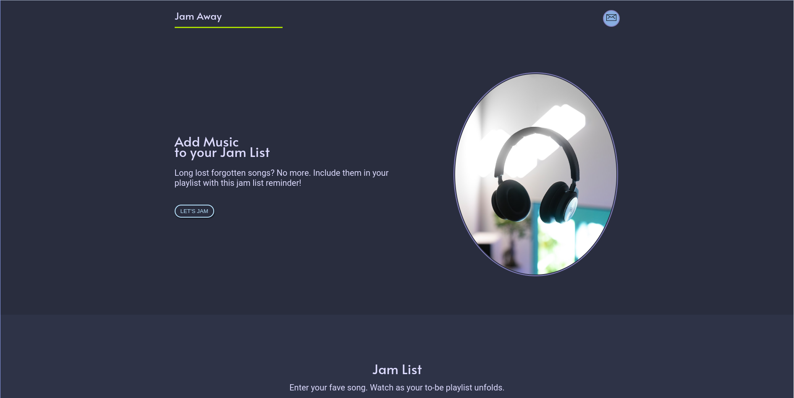
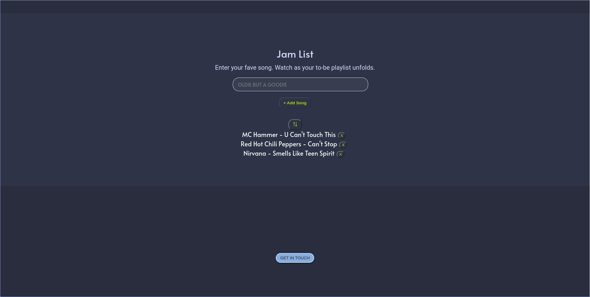
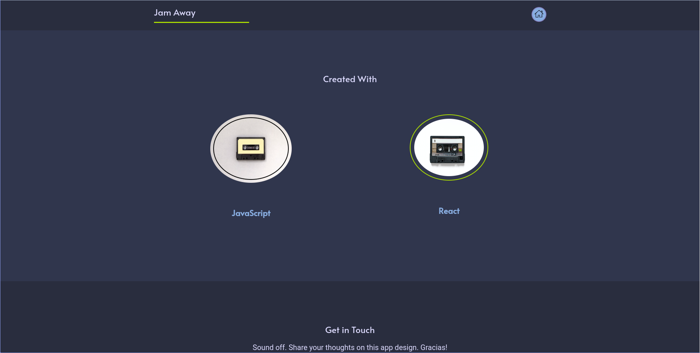
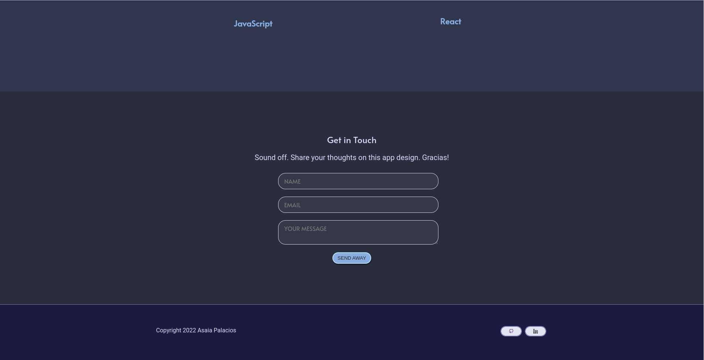

# Jam Away

  <picture>
    
  </picture>    

  <a href="https://github.com/asaiapalacios">Asaia Palacios</a>

## About Jam Away
_Jam Away_ invites users to jot down their long-lost songs, creating a list that can be sorted out or removed altogether. _Jam Away_ acts as a reminder to include your fave but forgotten songs on your next playlist. 

### Features
- Responsiveness for desktop, laptop and mobile
- Accessibility, descriptive labels when mouse hovers over the 'Contact' button and 'Home' button
- Button background-color change when mouse hovers over 'LET'S JAM'
- Upon clicking this call-to-action button, a scroll-down sliding behavior occurs to redirect the user to the 'Jam List' section
- Here, in the text field, user can jot down their fave song. By pressing the '+ Add Song' button or by hitting the Enter keyboard, user's song list is displayed. Note: button is disabled if no song is typed in the text field

  <picture>
    
  </picture>    

 
 - User can sort list of jams in ascending or descending order
 - User can remove songs from the Jam List
 - The 'GET IN TOUCH' button routs user to the Contact page

 

  <picture>
    
  </picture>    

 - I used a color picker from an extension in Chrome to pinpoint certain cassette colors, then used CSS Modules for styling these colors onto the 'Created With' section
 - The 'Get in Touch' section allows folks to share their thoughts on this Jam Away design and functionality

 

  <picture>
    
  </picture>    

 - The footer section includes GitHub and LinkedIn buttons that upon selecting either one, user is redirected to these URLs (a new tab window opens)
## Built With
- React.js
  - libraries: prop-types, react-router-dom and react-router-hash-link
- Airtable
   - acts as a headless CMS, fetching my content and connecting it to the front-end side with React.js
- CSS Modules
- Grid, Flexbox